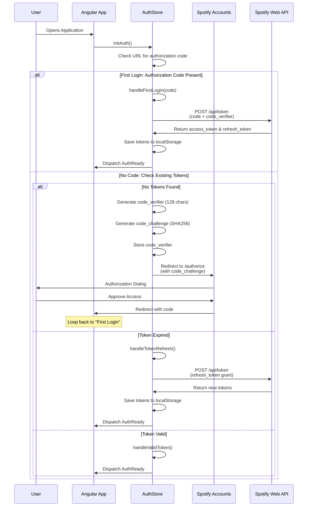

# Angular Spotify

[](https://deepwiki.com/trungvose/angular-spotify)

A simple Spotify client built with Angular 15, Nx workspace, ngrx, TailwindCSS and ng-zorro.

> I have recently shared about #angularspotify at [AngularAir](https://angularair.com), you can watch the session here 👉 [youtu.be/uPB0KHKlrU8][02-air]

## Working application

Check out the **live application** -> https://spotify.trungk18.com

**Spotify premium** is required for the Web Playback SDK to play music. If you are using a free account, you can still browse the app, but it couldn't play the music. Sorry about that 🤣

![Angular Spotify Demo][demo]

![Angular Spotify Visualizer][visualizer]

![Angular Spotify Browse][angular-spotify-browse]

![Angular Spotify Blurry Background][album-art]

![Angular Spotify PWA][pwa]

![Angular Spotify Web Player][web-player]

## Support

If you like my work, feel free to:

- ⭐ this repository. And we will be happy together :)
- [][tweet] about Angular Spotify
- <a title="Thanks for your support!" href="https://www.buymeacoffee.com/trungvose" target="_blank"></a>

Thanks a bunch for stopping by and supporting me!

[tweet]: https://twitter.com/intent/tweet?url=https://github.com/trungk18/angular-spotify&text=A%20cool%20Spotify%20client%20made%20with%20Angular%2012,%20Nx%20workspace,%20ngrx,%20TailwindCSS%20and%20ng-zorro%20%40trungvose&hashtags=angularspotify,angular,nx,ngrx,ngzorro,typescript

## Who is it for 🤷‍♀️

I still remember Window Media Player on windows has the visualization when you start to play the music, and I wanted to have the same experience when listening to Spotify. That is the reason I started this project.

I found that there weren't many resources on building a proper real-world scale application, and that's my focus for sharing. I made a [Jira clone application][jira] as the first one for that purpose. [Nx workspace][nx] is getting more and more attention from the Angular community, but people are always confused about how to architect and set up an Nx project. I hope Angular Spotify will give you more insight on that even though it is my first project using Nx 🤣

---

You know I am one of the moderators of [Angular Vietnam][angularvn]. Recently, I also started [Angular Singapore][angularsg]. This piece of work is my other long-term plan to bring Angular knowledge to more people. I desire to advocate and grow the Angular developer community in Singapore and Vietnam :)

## Tech stack

![Tech logos][stack]

- [Angular 15][angular]
- [Nx Workspace][nx]
- [ngneat][] packages includes: `ngneat/svg-icon` and `ngneat/until-destroy`
- [ngrx][ngrx] and [ngrx/component-store][component-store]
- [ng-zorro][ng-zorro] UI component: `tooltip`, `modal`, `slider`, `switch` and more.
- [TailwindCSS][tailwind] - See this video [Everything you need to know about TailwindCSS and Angular applications](https://youtu.be/zSXdJqEPy9w) by [@nartc][nartc] for integration TailwindCSS with Angular
- [Netlify][netlify] for deployment

[angular]: https://angular.io/
[ngrx]: https://ngrx.io/
[component-store]: https://ngrx.io/guide/component-store
[tailwind]: https://tailwindcss.com/
[ng-zorro]: https://ng.ant.design/docs/introduce/en
[netlify]: http://netlify.com/
[ngneat]: https://github.com/ngneat

I experimented with the ngrx/component store for `AuthStore` and `UIStore`. It might not be a best practice, and I will refactor it very soon. Just FYI 🤣

## High-level design

See my original notes on [Nx workspace structure for NestJS and Angular][gist]

### Principles

All components are following:

- OnPush Change Detection and async pipes: all components use observable and async pipe for rendering data without any single manual subscribe. Only some places are calling subscribe for dispatching an action, which I will have a refactor live stream session with my friend [@nartc][nartc] to use the component store for a fully subscribe-less application.
- SCAMs (single component Angular modules) for tree-shakable components, meaning each component will have a respective module. For example, a RegisterComponent will have a corresponding RegisterModule. We won't declare RegisterComponent as part of AuthModule, for instance.
- Mostly, everything will stay in the `libs` folder. New modules, new models, new configurations, new components etc... are in libs. libs should be separated into different directories based on existing apps. We won't put them inside the apps folder. For example in an Angular, contains the `main.ts`, `app.component.ts` and `app.module.ts`

### Structure

I followed the structure recommended by my friend [@nartc][nartc]. Below is the simplified version of the application structure.

```
.
└── root
    ├── apps
    │   └── angular-spotify
    └── libs
        └── web (dir)
            ├── shell (dir)
            │   ├── feature (angular:lib) - for configure any forRoot modules
            │   └── ui
            │       └── layout (angular:lib)
            ├── settings (dir)
            │   ├── feature (angular:lib) - for configure and persist all settings
            │   └── data-access (workspace:lib) - store and services for settings module
            ├── playlist (dir)
            │   ├── data-access (angular:lib, service, state management)
            │   ├── features
            │   │   ├── list (angular:lib PlaylistsComponent)
            │   │   └── detail (angular:lib PlaylistDetailComopnent)
            │   └── ui (dir)
            │       └── playlist-track (angular:lib, SCAM for Component)
            ├── visualizer (dir)
            │   ├── data-access (angular:lib)
            │   ├── feature
            │   └── ui (angular:lib)
            ├── home (dir)
            │   ├── data-access (angular:lib)
            │   ├── feature (angular:lib)
            │   └── ui (dir)
            │       ├── featured-playlists (angular:lib, SCAM for Component)
            │       ├── greeting (angular:lib, SCAM for Component)
            │       └── recent-played (angular:lib, SCAM for Component)
            └── shared (dir)
                ├── app-config (injection token for environment)
                ├── data-access (angular:lib, API call, Service or State management to share across the Client app)
                ├── ui (dir)
                ├── pipes (dir)
                ├── directives (dir)
                └── utils (angular:lib, usually shared Guards, Interceptors, Validators...)
```

### Authentication Flow

> **⚠️ Migration Notice:** This application previously used the `Implicit Grant Flow`, which [will be sunset on November 27, 2025](https://developer.spotify.com/documentation/web-api/tutorials/implicit-flow). The application has been migrated to use **Authorization Code with PKCE** flow, which is the recommended approach for client-side only applications that don't involve secret keys.

I follow the **Authorization Code with PKCE** flow that Spotify recommends for client-side only applications. This flow provides better security than the deprecated Implicit Grant Flow and includes refresh tokens to extend access when tokens expire.

View the [Spotify Authorization Guide](https://developer.spotify.com/documentation/general/guides/authorization-guide/) and [Authorization Code PKCE Tutorial](https://developer.spotify.com/documentation/web-api/tutorials/code-pkce-flow)

- Upon opening Angular Spotify, It will redirect you to Spotify to get access to your data. Angular Spotify only uses the data purely for displaying on the UI. We won't store your information anywhere else.
- Angular Spotify stores the access token and refresh token in browser local storage. Access tokens are valid for **one hour** and are automatically refreshed using the refresh token when they expire.
- After having the token, I'll try to connect to the Web Playback SDK with a new player - `Angular Spotify Web Player`

#### Authorization Code with PKCE Flow Diagram



![Angular Spotify Web Playback SDK flow][sdk-flow]

### Dependency Graph

Nx provides an [dependency graph][dep-graph-nx] out of the box. To view it on your browser, clone my repository and run:

```bash
npm run dep-graph
```

A simplified graph looks like the following. It gives you insightful information for your mono repo and is especially helpful when multiple projects depend on each other.

![Angular Spotify Dependency Graph][dep-graph]

### Nx Computation Cache

Having Nx Cloud configured shortens the deployment time quite a lot.

Nx Cloud pairs with Nx in order to enable you to build and test code more rapidly, by up to 10 times. Even teams that are new to Nx can connect to Nx Cloud and start saving time instantly. Visit [Nx Cloud](https://nx.app/) to learn more.

![Nx cloud][nx-cloud]

## Features and Roadmap

I set a tentative deadline for motivating myself to finish the work on time. Otherwise, It will take forever to complete :)

### 1.0 - Simple Spotify client

> March 01 - 28, 2021

- [x] Proven, scalable, and easy to understand the structure with Nx workspace
- [x] Play music using Spotify SDK
- [x] Load a maximum of 50 save playlists and top 100 songs per playlist.
- [x] Cool visualization

## Live stream

Let work on it together!

I scheduled a few live stream sessions to show you how I continue developing Angular Spotify. Follow [my twitter][twitter] for the latest updates. See the scheduled events.

| #   | Time                       | Description/Link                                                |
| --- | -------------------------- | --------------------------------------------------------------- |
| 1   | Sat, 3rd April 2021, 10AM  | [Structure your Angular application with Nx workspace][live-01] |
| 2   | Sat, 10th April 2021, 10AM | [Build the album list page][live-02]                            |
| 3   | Sat, 17th April 2021, 10AM | [Build the album detail page - part 1][live-03]                 |
| 4   | Sat, 24th April 2021, 10AM | [Build the album detail page - part 2][live-04]                 |
| 5   | Sat, 8th May 2021, 10AM    | [Build the artist detail page - part 1][live-05]                |
| 6   | Sat, 15th May 2021, 10AM   | [Build the artist detail page - part 2][live-06]                |
| 7   | Sat, 12th Jun 2021, 10AM   | [Build the track list page - part 1][live-07]                   |
| 8   | Sat, 19th Jun 2021, 10AM   | [Build the track list page - part 2][live-08]                   |
| 9   | Sun, 11th July 2021, 10AM  | [NgRx Component Store Unit Testing][live-09]                    |
| 10  | TBD                        | Config Nx build:affected with Github action                     |

I will also do some refactoring with [@nartc][nartc] for Angular Vietnam Office Hours. More detail is coming soon.

[live-01]: https://www.youtube.com/watch?v=9njo6MZWBN0
[live-02]: https://www.youtube.com/watch?v=vEIxjcrXcDc
[live-03]: https://youtu.be/c9-WTksAv-s
[live-04]: https://www.youtube.com/watch?v=8P3pB40JF2w
[live-05]: https://youtu.be/fNhdd-O5c9c
[live-06]: https://youtu.be/Tt51-pxm6Ko
[live-07]: https://youtu.be/Oj4yomnxfj4
[live-08]: https://youtu.be/1h5KKFSj9Es
[live-09]: https://youtu.be/owwRjxm0zs0

## Community

I have received some invitations to talk about Angular Spotify from the community. You can watch my talks below 🙂

[][01-beeman]

[][02-air]

| #   | Time                 | Description/Link                                   |
| --- | -------------------- | -------------------------------------------------- |
| 1   | Wed, 21st April 2021 | [BLS SHOW & TELL - Angular Spotify][01-beeman]     |
| 2   | Fri, 08th May 2021   | [AngularAir - Another 1k stars repository][02-air] |

[01-beeman]: https://youtu.be/9zJcb6ZhBaI
[02-air]: https://youtu.be/uPB0KHKlrU8

## Time spending

It is a side project that I only spent time outside of the office hours to work on. I initially planned to complete the project within two weeks, but the first two weekends were not very productive, maybe because of the holiday mood from Lunar New Year :) But once the lego blocks are getting together, I feel the rhythm, and I know it has to be finished by the end of March.

I couldn't get the full-time report from waka time because it only shows me the latest two weeks. 🤣

I have spent approximately 50 hours working on this project, which is almost the same amount as the first version of [jira.trungk18.com][jira].

The visualizer was the most exciting feature, and I decided to start this project because of that single component.

![Angular Spotify - Time spending][time]

### Accessibility ♿

Not all components have properly defined [aria attributes](https://developer.mozilla.org/en-US/docs/Web/Accessibility/ARIA), visual focus indicators, etc.

## Setting up the development environment 🛠

- `git clone https://github.com/trungk18/angular-spotify.git`
- `cd angular-spotify`
- `npm start` for starting Angular web application
- The app should run on `http://localhost:4200/`

### Unit/Integration tests 🧪

I skipped writing test for this project.

## Compatibility

Web Playback SDK supports Chrome, Firefox, Edge, IE 11, or above running on Mac/Windows/Linux.

It **doesn't support** Safari or any mobile browser on **Android** or **iOS**

View [completed list of supported browsers](https://developer.spotify.com/documentation/web-playback-sdk/#supported-browsers)

## Author: Trung Vo ✍️

- A seasoned front-end engineer with seven years of passion in creating experience-driven products. I am proficient in Angular, React and TypeScript development.
- Personal blog: https://trungk18.com/
- Say hello: trungk18 [et] gmail [dot] com

## Contributing

If you have any ideas, just [open an issue][issues] and tell me what you think.

If you'd like to contribute, please fork the repository and make changes as you'd like. [Pull requests][pull] are warmly welcome.

## Credits and reference

Special thanks to my friend [@nartc][nartc], who helped me review the code early.

| Resource                                                               | Description                                                                                                           |
| ---------------------------------------------------------------------- | --------------------------------------------------------------------------------------------------------------------- |
| [@koel/koel][koel]                                                     | A cool player made by [@phanan][phanan], I reused the visualizer code from this repo with my additional customization |
| [beeman/component-store-playground][beeman/component-store-playground] | A nice example of using Nx with ngrx/component-store, I refer to the project structure from this repo                 |
| [Start using ngrx/effects for this][tim]                               | An excellent write up by [Tim Deschryver][tim-twitter]                                                                |

[koel]: https://github1s.com/koel/core/blob/master/js/utils/visualizer.ts
[phanan]: https://twitter.com/notphanan
[beeman/component-store-playground]: https://github.com/beeman/component-store-playground
[tim]: https://timdeschryver.dev/blog/start-using-ngrx-effects-for-this
[tim-twitter]: https://twitter.com/tim_deschryver

## License

Feel free to use my code on your project. Please put a reference to this repository.

[MIT](https://opensource.org/licenses/MIT)

[issues]: https://github.com/trungk18/angular-spotify/issues/new
[pull]: https://github.com/trungk18/angular-spotify/compare
[jira]: https://jira.trungk18.com/
[twitter]: https://twitter.com/trungvose
[nx]: https://nx.dev/
[angularsg]: https://twitter.com/angularsg
[angularvn]: https://twitter.com/ngvnofficial
[nartc]: https://github.com/nartc
[gist]: https://gist.github.com/trungk18/7ef8766cafc05bc8fd87be22de6c5b12
[dep-graph-nx]: https://nx.dev/latest/angular/structure/dependency-graph
[stack]: /libs/web/shared/assets/src/assets/readme/angular-spotify-tech-stack.png
[time]: /libs/web/shared/assets/src/assets/readme/time-spending.png
[dep-graph]: /libs/web/shared/assets/src/assets/readme/dep-graph.png
[sdk-flow]: /libs/web/shared/assets/src/assets/readme/sdk-flow.png
[demo]: /libs/web/shared/assets/src/assets/readme/angular-spotify-demo-short.gif
[visualizer]: /libs/web/shared/assets/src/assets/readme/angular-spotify-visualization.gif
[angular-spotify-browse]: /libs/web/shared/assets/src/assets/readme/angular-spotify-browse.gif
[album-art]: /libs/web/shared/assets/src/assets/readme/angular-spotify-album-art.gif
[pwa]: /libs/web/shared/assets/src/assets/readme/angular-spotify-pwa.gif
[web-player]: /libs/web/shared/assets/src/assets/readme/angular-spotify-web-player.png
[nx-cloud]: /libs/web/shared/assets/src/assets/readme/nx-cloud.png
