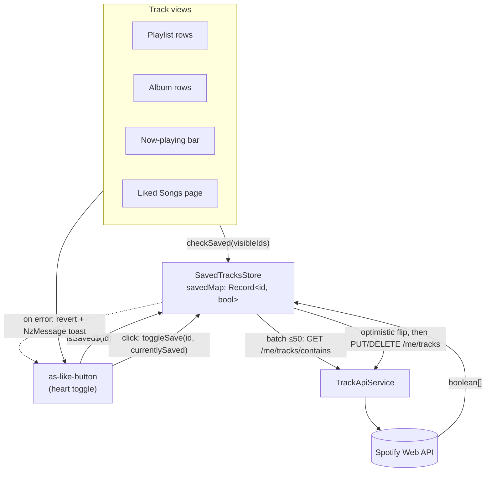
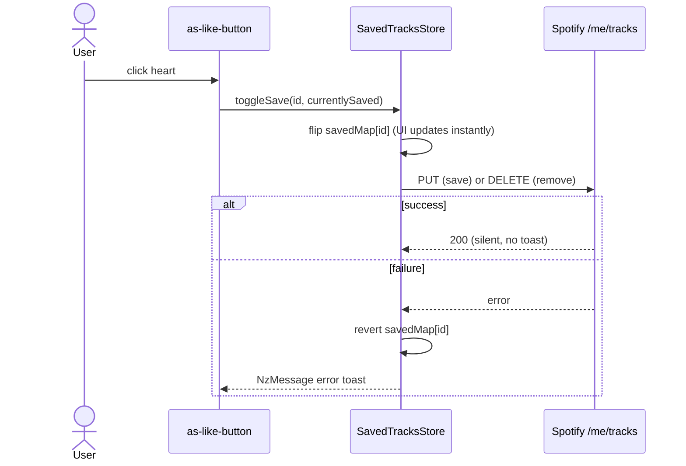
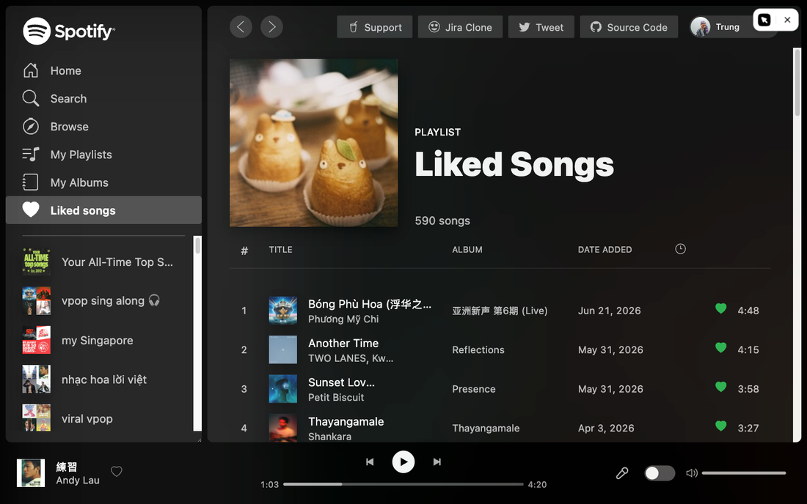
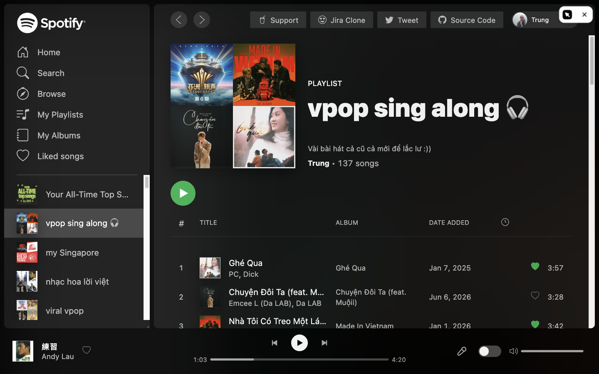
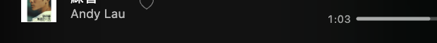

# Add / Remove Favorite Songs — Design

**Date:** 2026-06-19
**Status:** Approved for planning

## Summary

Let users save (favorite) and remove tracks from their Spotify library directly from
the app. A heart toggle appears on playlist track rows, album track rows, the
now-playing bar, and the Liked Songs page. State is held in a shared store so the same
track shows a consistent saved/unsaved state everywhere. Toggling is optimistic, with an
error toast and rollback on failure.

## How it works

A single root `SavedTracksStore` is the source of truth for every track's saved
state, so the heart looks consistent across all surfaces. Each view batch-checks
its visible tracks; the reusable `as-like-button` reads per-track state and toggles
optimistically.



Toggle sequence (optimistic, silent on success, revert + toast on failure):



## Spotify Web API

The feature uses three Spotify Web API endpoints (all covered by the existing Bearer-token
auth interceptor):

| Action | Endpoint | Notes |
|--------|----------|-------|
| Save tracks | `PUT /me/tracks?ids={ids}` | Up to 50 IDs per call |
| Remove tracks | `DELETE /me/tracks?ids={ids}` | Up to 50 IDs per call |
| Check saved | `GET /me/tracks/contains?ids={ids}` | Returns `boolean[]` aligned to input order |

The existing `getUserSavedTracks()` (`GET /me/tracks`) already powers the Liked Songs page
and is unchanged.

## Architecture

Four layers, built bottom-up:

| Layer | What | Location |
|-------|------|----------|
| API | 3 new methods on `TrackApiService` | `libs/web/shared/data-access/spotify-api/src/lib/track-api.ts` |
| State | New global `SavedTracksStore` (ComponentStore, `providedIn: 'root'`) | `libs/web/shared/data-access/store/src/lib/saved-tracks/` |
| UI | New reusable `as-like-button` (heart toggle) | `libs/web/shared/ui/like-button/` |
| Integration | Button wired into 4 existing components | playlist-track, album-track, now-playing-bar, tracks (Liked Songs) |

The store is the single source of truth: liking a track in a playlist instantly reflects in
the now-playing bar and anywhere else that track is shown.

## Components

### 1. API methods (`TrackApiService`)

```ts
saveTracks(ids: string[])        // PUT    /me/tracks?ids=...
removeTracks(ids: string[])      // DELETE /me/tracks?ids=...
checkSavedTracks(ids: string[])  // GET    /me/tracks/contains?ids=...  → Observable<boolean[]>
```

All accept arrays. IDs are joined with commas into the `ids` query param. Each returns an
`Observable`, matching the existing service style. Exported via the existing barrel
`libs/web/shared/data-access/spotify-api/src/index.ts` (already re-exports `track-api`).

### 2. `SavedTracksStore`

A global `ComponentStore`, `providedIn: 'root'`, living beside `PlaybackStore`.

**State**

```ts
interface SavedTracksState {
  savedMap: Record<string, boolean>; // trackId -> saved
}
```

Initial state: `{ savedMap: {} }`.

**Effects / updaters**

- `checkSaved(ids: string[])` — effect. Filters out IDs already present in `savedMap`,
  batches the rest (chunks of 50), calls `checkSavedTracks`, and merges results into
  `savedMap` via `patchState`. No-op when all IDs are already known.
- `toggleSave({ id, currentlySaved }: { id: string; currentlySaved: boolean })` — effect.
  Optimistically flips `savedMap[id]` immediately, then calls `saveTracks([id])` or
  `removeTracks([id])`. On error, reverts `savedMap[id]` to its previous value and shows an
  error toast via `NzMessageService`.

**Selectors**

- `isSaved$(id: string): Observable<boolean>` — derives the saved state for a single track
  from `savedMap` (defaults to `false` when unknown).

### 3. `as-like-button` component

- **Selector:** `as-like-button`
- **Input:** `trackId: string`
- **Behavior:** subscribes to `savedTracksStore.isSaved$(trackId)`. Renders the `heart-fill`
  icon (saved, accent color) or the `heart` outline icon (unsaved). On click, calls
  `savedTracksStore.toggleSave({ id, currentlySaved })` and calls `stopPropagation()` so the
  click does not trigger the row's play action.
- `ChangeDetectionStrategy.OnPush`. Reuses the existing `heart` / `heart-fill` SVG icons.

### 4. Integration points

- **Playlist view** (`playlist-track` + its parent): parent collects the visible track IDs
  and calls `savedTracksStore.checkSaved(ids)` when the playlist loads. Each row renders
  `<as-like-button [trackId]="item.track.id">`.
- **Album view** (`album-track` + its parent): same pattern — parent batch-checks visible
  IDs on load, each row gets a like button.
- **Now-playing bar** (`now-playing-bar`): subscribes to `currentTrack$`; when a track is
  present, calls `checkSaved([id])` and renders the like button for it.
- **Liked Songs page** (`tracks` feature): every listed track is saved by definition. The
  like button (filled) lets the user un-like; doing so optimistically removes the row from
  `TracksStore.data` and reverts on error. The store seeds `savedMap` entries as `true`
  for its loaded tracks so the button renders filled without an extra contains-check.

## Data flow

1. A list view loads tracks → parent extracts track IDs → `savedTracksStore.checkSaved(ids)`.
2. Store batch-calls `GET /me/tracks/contains` for unknown IDs → merges booleans into `savedMap`.
3. Each `as-like-button` reads `isSaved$(id)` → renders filled/outline heart.
4. User clicks → `toggleSave` flips `savedMap[id]` optimistically → button updates instantly
   everywhere that track appears.
5. `PUT`/`DELETE` fires in the background. On failure → revert `savedMap[id]` + error toast.

## Error handling

Introduce ng-zorro `NzMessageService` (already a project dependency, not yet wired):

- Register `NzMessageModule` once in the app module (`apps/angular-spotify/src/app/app.module.ts`).
- On a failed save/remove, show an error message (e.g. "Couldn't update Liked Songs").
- Success is silent (per UX decision: optimistic + toast on error only).

This replaces the `alert()` pattern for this feature and provides reusable toast infra.

## Testing (Jest)

- **`SavedTracksStore` spec:** optimistic flip on toggle; rollback + toast on API error;
  batch merge of contains results; dedupe of already-known IDs; chunking when > 50 IDs.
- **`LikeButtonComponent` spec:** renders `heart-fill` when saved and `heart` when not;
  click invokes `toggleSave` with correct args; click stops propagation.
- **`TrackApiService` spec:** `saveTracks` / `removeTracks` / `checkSavedTracks` issue the
  correct method, URL, and `ids` param, using `HttpTestingController`.

## Out of scope (YAGNI)

- Saving/removing multiple tracks in one user gesture (bulk select).
- Saving albums or playlists (only individual tracks).
- Real-time sync if the library changes in another Spotify client.

## Verification (browser)

Verified against a logged-in Spotify account running the dev server.

**Liked Songs** — every row shows a filled heart (saved):



**Playlist** — per-track `checkSaved` produces a mix of filled (saved) and outline
(unsaved) hearts (21 outline / 30 filled on this playlist):



**Now-playing bar** — the current track shows its like toggle next to the track info:


